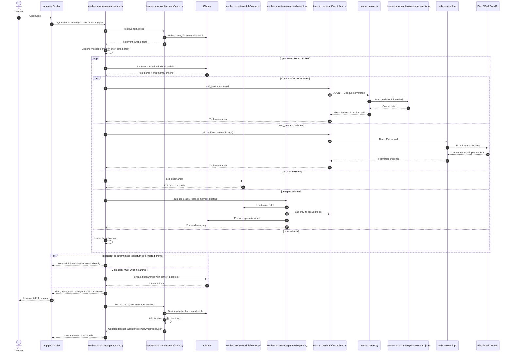

# Teacher's Assistant — Local Agent Demo

A small AI agent whose model and course data run on your laptop. It plays the
part of a professor's assistant: it can pull up students, crunch class stats,
draw charts, remember things you tell it between sessions, and optionally use
key-free web research when it needs current outside knowledge.

You'll build your capstone off this, so get it running before class.

## Setup — do this BEFORE class

The model downloads are about 4.5 GB total. Classroom wifi will not save you.

**1. Install [Ollama](https://ollama.com/download)**, then pull the two models:

```bash
ollama pull gemma3:4b
ollama pull bge-m3
```

**2. Install [uv](https://docs.astral.sh/uv/getting-started/installation/) if
you do not already have it, then clone this repo and create its environment:**

```bash
git clone <this-repo-url>
cd AgentDemo
uv venv --python 3.11
uv sync
```

UV creates and manages the local `.venv` automatically. You do not need to
activate it manually; `uv run` uses the project environment below.

**3. Check everything:**

```bash
uv run python setup_check.py
```

All green means you're ready. Anything red prints the exact command to fix it.

**4. Run it:**

```bash
uv run python app.py
```

Your browser opens to `http://127.0.0.1:7860`. Ask it "How is Sam Rivera
doing?" and watch the Trace tab while it answers.

**Slow machine?** Open `teacher_assistant/settings.py` and switch `MODEL` to `gemma3:1b`
(pull it first). Everything still works, the answers are just less sharp.

## Architecture — how the repository fits together

The shortest useful description is:

> `app.py` receives a message, `teacher_assistant/agents/main.py` decides what information it needs,
> normal Python code performs the requested work, and Ollama turns the verified
> results into a natural-language answer.

The LLM does **not** directly run Python functions or open the gradebook. It
writes a small, schema-constrained decision such as "call `student_report` with
`student=Sam Rivera`". The Python agent validates that decision and performs
the call.

### Complete component diagram

```mermaid
flowchart TB
    teacher["Teacher<br/>web browser"]

    subgraph main["Main Python process — uv run python app.py"]
        app["app.py<br/>Gradio UI, callbacks, live panels"]
        state["Short-term state<br/>messages list in gr.State"]
        agent["teacher_assistant/agents/main.py<br/>main decide → act → answer loop"]
        memory["teacher_assistant/memory/store.py<br/>retrieve, extract, reconcile, save"]
        loader["teacher_assistant/skills/loader.py<br/>discover metadata, load instructions"]
        child["teacher_assistant/agents/subagent.py<br/>isolated specialist agent loop"]
        client["teacher_assistant/mcp/client.py<br/>sync wrapper around async MCP"]
        research["web_research.py<br/>DuckDuckGo search with Bing fallback"]
    end

    subgraph ollama["Ollama local service"]
        chatmodel["gemma3:4b<br/>decisions, answers, memory judgments"]
        embedmodel["bge-m3<br/>text → embedding vectors"]
    end

    subgraph toolprocess["Child process started by teacher_assistant/mcp/client.py"]
        server["teacher_assistant/mcp/course_server.py<br/>MCP tool definitions"]
    end

    publicweb["Public search result pages<br/>no API key"]

    subgraph files["Files on disk"]
        readme["README.md<br/>human documentation"]
        project["pyproject.toml<br/>Python dependencies"]
        setup["setup_check.py<br/>preflight entry point"]
        config["teacher_assistant/settings.py<br/>all runtime settings and resolved paths"]
        data["teacher_assistant/mcp/course_data.json<br/>gradebook source of truth"]
        memories["teacher_assistant/memory/memories.json<br/>durable facts + embeddings"]
        skills["teacher_assistant/skills/*/SKILL.md<br/>procedures loaded on demand"]
        charts["teacher_assistant/mcp/charts/*.png<br/>generated artifacts"]
        ignore[".gitignore<br/>excludes runtime state"]
        cache["__pycache__/<br/>generated bytecode"]
    end

    teacher -->|"send message / see updates"| app
    app <--> state
    app -->|"on_send → run_turn"| agent
    agent -->|"decide and stream answer"| chatmodel
    agent -->|"retrieve / extract / remember"| memory
    memory <--> memories
    memory -->|"embed text"| embedmodel
    memory -->|"extract or reconcile facts"| chatmodel
    agent -->|"list or load a skill"| loader
    loader --> skills
    agent -->|"delegate a whole job"| child
    child -->|"its own decisions and answer"| chatmodel
    child -->|"load its owned procedure"| loader
    agent -->|"call_tool"| client
    child -->|"restricted call_tool"| client
    client <-->|"JSON-RPC over stdin/stdout"| server
    server -->|"read on every tool call"| data
    server -->|"write chart image"| charts
    charts -->|"path returned in generator event"| app
    client -->|"direct Python call"| research
    research <-->|"HTTPS"| publicweb

    project -.->|"install dependencies"| app
    project -.->|"install dependencies"| server
    setup -.->|"check models"| chatmodel
    setup -.->|"check models"| embedmodel
    setup -.->|"test discovery"| client
    config -.-> app
    config -.-> agent
    config -.-> memory
    config -.-> child
    config -.-> loader
    config -.-> client
    config -.-> research
    config -.-> setup
    ignore -.-> memories
    ignore -.-> charts
    app -.->|"imports create bytecode"| cache

    %% Connections are numbered by declaration order above (starting at 0).
    %% Keep these groups in sync if an edge is added or removed.
    linkStyle 0,1,2 stroke:#06B6D4,stroke-width:3px;
    linkStyle 3 stroke:#F59E0B,stroke-width:3px;
    linkStyle 4,5,6,7 stroke:#22C55E,stroke-width:3px;
    linkStyle 8,9,10,11,12,14 stroke:#A855F7,stroke-width:3px;
    linkStyle 13,15,16,17,18,19,20 stroke:#3B82F6,stroke-width:3px;
    linkStyle 21,22,23,24,25,26,27,28,29,30,31,32,33,34,35,36 stroke:#94A3B8,stroke-width:2px;
```



Line-color guide:

| Color | Connection type | Example path |
|---|---|---|
| **Cyan** | User interface and event flow | Teacher → `app.py` → `teacher_assistant/agents/main.py` |
| **Amber** | Main agent's direct chat-model call | `teacher_assistant/agents/main.py` → `gemma3:4b` |
| **Green** | Long-term memory and embeddings | `teacher_assistant/agents/main.py` → `teacher_assistant/memory/store.py` → model/files |
| **Purple** | Skills and delegated subagent work | Main agent → `teacher_assistant/agents/subagent.py` / `teacher_assistant/skills/loader.py` |
| **Blue** | Tool calls, deterministic data, artifacts, and public-web evidence | Agent → client → MCP or web research |
| **Gray dotted** | Setup, configuration, dependencies, and generated files | `teacher_assistant/settings.py`, `pyproject.toml`, `uv.lock`, `.gitignore`, `__pycache__` |

There are four important runtime boundaries:

1. **The main Python process** contains the UI and orchestration code. These
   modules can call each other as normal Python.
2. **The MCP tool process** runs `teacher_assistant/mcp/course_server.py`
   separately. The client discovers its course tools, then adds its own
   `web_research` capability to the same tool menu.
3. **Public search pages** are the network boundary. Only the search query is
   sent to Bing or DuckDuckGo; no API key is needed, and course data and memory
   are never sent with it.
4. **Ollama** is another local process. Python sends prompts to it through the
   `ollama` package. The chat model writes decisions and answers; the embedding
   model turns text into vectors for semantic memory search.

The application code lives below the `teacher_assistant` umbrella package.
That lets the repository teach MCP with a plainly named `teacher_assistant.mcp`
subpackage without shadowing the installed top-level `mcp` SDK.

### Where execution begins

`uv run python app.py` is the normal entry point. UV selects the project
environment, then Python executes top-level module
code from top to bottom:

1. `app.py` imports the supporting modules and reads settings from
   `teacher_assistant/settings.py`.
2. It creates `MCPClient` and immediately calls `MCP.connect()`.
3. `teacher_assistant/mcp/client.py` starts an asyncio event loop on a
   background thread, launches `teacher_assistant/mcp/course_server.py` with
   the same Python interpreter, discovers its tools, and adds the client-owned
   `web_research` tool.
4. `app.py` synchronously warms the embedding model and then the chat model,
   using the same bounded context as live requests. The UI opens only when the
   models are ready, so the first message does not pay the load cost.
5. The Gradio components and callback wiring are created.
6. The `if __name__ == "__main__"` block calls `demo.launch()`, which opens the
   local web application.
7. Nothing in `teacher_assistant.agents.main.run_turn()` runs until the teacher clicks **Send** or
   presses Enter. Gradio then calls `app.on_send()`, which iterates the
   `run_turn()` generator and paints each yielded event into the appropriate
   panel.

`uv run python setup_check.py` is a separate, optional entry point. It performs
preflight checks and exits; it does not start the application.

### One chat turn, end to end



The main loop in `teacher_assistant.agents.main.run_turn()` has five phases:

1. **Recall:** retrieve relevant long-term facts before reasoning.
2. **Prepare context:** append the new user message, trim old short-term
   messages, and decide which skills or specialists are eligible.
3. **Decide and act:** ask the model for exactly one next action. Execute a
   server tool, load a skill, delegate, or stop. Tool results are added to the
   next prompt, then the loop repeats.
4. **Answer:** return already-finished specialist or arithmetic output directly;
   otherwise make one normal Ollama call using the verified results.
5. **Reflect:** after the answer is visible, extract durable facts and save
   them for future conversations.

### Repository map: what every file does and who first uses it

The two runnable Python files and the small key-free research helper stay at
the repository root. Other supporting code is grouped by role under one
application package:

```text
app.py
setup_check.py
web_research.py
teacher_assistant/
├── __init__.py
├── settings.py
├── agents/
│   ├── __init__.py
│   ├── main.py
│   └── subagent.py
├── memory/
│   ├── __init__.py
│   ├── store.py
│   └── memories.json
├── mcp/
│   ├── __init__.py
│   ├── client.py
│   ├── course_server.py
│   ├── course_data.json
│   └── charts/
└── skills/
    ├── __init__.py
    ├── loader.py
    ├── check-in-email/SKILL.md
    └── weekly-report/SKILL.md
tests/
README.md
pyproject.toml
uv.lock
```

The folders answer four beginner questions directly: who coordinates work
(`agents`), where durable facts live (`memory`), where deterministic tools and
their assets live (`mcp`), and where reusable procedures live (`skills`).

| Path | Responsibility | Where it first enters the runtime |
|---|---|---|
| [README.md](README.md) | Human documentation. It is not imported by the application. | You are reading it now. |
| [pyproject.toml](pyproject.toml) | Declares the Python project metadata and runtime dependencies. | `uv sync`, before runtime. |
| [uv.lock](uv.lock) | Pins the resolved dependency versions for repeatable environments. | Read automatically by `uv sync`. |
| [.gitignore](.gitignore) | Keeps environments, caches, memories, and generated charts out of Git. | Git reads it; Python does not. |
| [setup_check.py](setup_check.py) | Checks Python, packages, Ollama, configured models, and MCP tool discovery. | Run with `uv run python setup_check.py`. |
| [app.py](app.py) | Main entry point. Builds the Gradio UI, connects MCP, wires buttons, streams generator events, and renders the teaching panels. | Run with `uv run python app.py`; `on_send()` begins a turn. |
| [web_research.py](web_research.py) | Key-free public-web search using DuckDuckGo with a Bing fallback, result deduplication, and compact URL-bearing output. | `MCPClient.call_tool("web_research", ...)` invokes it directly. |
| [teacher_assistant/settings.py](teacher_assistant/settings.py) | Central settings: model names, context size, thresholds, loop limits, and resolved project paths. | Imported by the root entry points and role packages. |
| [teacher_assistant/agents/main.py](teacher_assistant/agents/main.py) | Main orchestration loop. Builds prompts and schemas, recalls memory, chooses actions, executes tools/skills/delegation, streams the answer, and reflects afterward. | `app.on_send()` calls `run_turn()`. |
| [teacher_assistant/agents/subagent.py](teacher_assistant/agents/subagent.py) | Defines specialist configurations and runs an isolated decide/act/answer loop with a restricted tool list. | Listed by `app.render_tools()`; executed for a `delegate` decision. |
| [teacher_assistant/memory/store.py](teacher_assistant/memory/store.py) | Long-term-memory service. Loads/saves JSON, creates embeddings, retrieves relevant facts, and reconciles updates. | The UI reads it at startup; `run_turn()` calls `retrieve()` at the start of every turn. |
| [teacher_assistant/memory/memories.json](teacher_assistant/memory/memories.json) | Runtime database of durable fact text and embedding vectors. It may be empty and is intentionally ignored by Git. | Read by `store.load()`; written by `store.remember()` after a turn. |
| [teacher_assistant/skills/loader.py](teacher_assistant/skills/loader.py) | Finds skill files, reads their small frontmatter summaries, and loads a full procedure only when requested. | `app.render_tools()` lists metadata at startup; an agent later calls `load_skill()`. |
| [teacher_assistant/skills/weekly-report/SKILL.md](teacher_assistant/skills/weekly-report/SKILL.md) | Procedure for producing a whole-class weekly report. | Its metadata is discovered at startup; its body loads only when requested. |
| [teacher_assistant/skills/check-in-email/SKILL.md](teacher_assistant/skills/check-in-email/SKILL.md) | Procedure for drafting one student's check-in email. | Normally loaded by the subagent; the main agent can load it when delegation is disabled. |
| [teacher_assistant/mcp/client.py](teacher_assistant/mcp/client.py) | Bridges synchronous agent code to the asynchronous course MCP and exposes key-free web research through the same tool interface. | `app.py` creates `MCPClient` and calls `connect()` during startup. |
| [teacher_assistant/mcp/course_server.py](teacher_assistant/mcp/course_server.py) | Separate MCP server containing deterministic tools for math, reports, rosters, statistics, deadlines, and charts. | Launched as a child process by `MCPClient.connect()`; `server.run()` waits for JSON-RPC requests. |
| [teacher_assistant/mcp/course_data.json](teacher_assistant/mcp/course_data.json) | Gradebook source of truth. The LLM never receives the file directly. | `_load_data()` reads it inside each relevant MCP tool call. |
| `teacher_assistant/mcp/charts/` | Runtime output directory for PNGs created by `chart_grades()`. | Written by the MCP server; returned through the generator to Gradio. |
| `teacher_assistant/**/__init__.py` | Side-effect-free package markers that make role boundaries and imports explicit. | Python reads them while importing the local package. |
| `__pycache__/` | Python bytecode cache. It is generated automatically and contains no application logic to study. | Created by Python imports; ignored by Git. |

Short-term memory does not get its own file because it does not need one. It
is a plain list of `{role, content}` dictionaries stored in Gradio's
`messages_state`, passed into `teacher_assistant.agents.main.run_turn()`, and trimmed by
`trim_short_term()`. Once an old message falls off that list, its bytes are no
longer sent to the model.

### Where state lives

| State | Lifetime | Owner | Why it exists |
|---|---|---|---|
| Visible chat (`chat`) | Until the UI is reset | `app.py` | Lets the human see the full conversation, including messages no longer sent to the model. |
| Short-term messages (`messages`) | Current conversation, capped by `SHORT_TERM_MAX_TURNS` | Gradio state + `teacher_assistant/agents/main.py` | Supplies recent conversational context to prompts. |
| Recalled memories (`memories`) | One turn | `teacher_assistant/agents/main.py` | Holds only durable facts relevant to the current question. |
| Tool observations (`observations`) | One turn | `teacher_assistant/agents/main.py` or `teacher_assistant/agents/subagent.py` | Carries exact tool results into the next decision and final answer. |
| Loaded skills (`loaded_skills`) | One turn | `teacher_assistant/agents/main.py` | Adds a large procedure only after the model requests it. |
| Durable facts | Across conversations and restarts | `teacher_assistant/memory/memories.json` through `teacher_assistant/memory/store.py` | Remembers teacher/student context that the gradebook cannot know. |
| Subagent panel/context | One delegated job | `teacher_assistant/agents/subagent.py` + `app.py` | Isolates specialist instructions and tool results; only finished work returns to the parent. |
| Gradebook | Until the JSON file changes | `teacher_assistant/mcp/course_data.json` through `teacher_assistant/mcp/course_server.py` | Keeps authoritative course data outside the LLM. |

An embedding is meaningful only in the vector space of the model that created
it. If `EMBED_MODEL` changes, `teacher_assistant/memory/store.py` detects
incompatible stored vectors, re-embeds the fact text, and updates
`teacher_assistant/memory/memories.json`. The first semantic lookup
after a model change can therefore be slower; later lookups reuse the migrated
vectors.

### A Python detail that explains “where it is called”

- An `import` executes a module's top-level statements once, then caches that
  module. This is why importing `app.py` would connect MCP and construct the UI.
- A `def` statement creates a function; it does **not** run the function body.
  `on_send()` waits until Gradio invokes it after a UI event.
- `if __name__ == "__main__"` runs only when that file is launched directly.
  It launches Gradio in `app.py` and starts the MCP request loop in
  `teacher_assistant/mcp/course_server.py`.
- `@server.tool()` runs while `teacher_assistant/mcp/course_server.py` starts and registers the
  decorated function. The function body itself runs later, only when an MCP
  request selects that tool.
- `yield` makes `run_turn()` and `on_send()` generators. Each `yield` pauses the
  function and lets Gradio update the screen before execution resumes.

### Suggested reading order for a junior engineer

1. Start with [teacher_assistant/settings.py](teacher_assistant/settings.py) to
   learn the vocabulary, limits, and resolved paths.
2. In [app.py](app.py), read the startup block, `on_send()`, callback wiring,
   and the final `demo.launch()` block.
3. Read `run_turn()` in
   [teacher_assistant/agents/main.py](teacher_assistant/agents/main.py) from its five numbered phases.
   Then read `build_system_prompt()`, `build_decision_schema()`, and `decide()`.
4. Follow one tool call through `MCPClient.call_tool()` in
   [teacher_assistant/mcp/client.py](teacher_assistant/mcp/client.py) to one decorated function in
   [teacher_assistant/mcp/course_server.py](teacher_assistant/mcp/course_server.py), then into
   [teacher_assistant/mcp/course_data.json](teacher_assistant/mcp/course_data.json).
5. Read [teacher_assistant/memory/store.py](teacher_assistant/memory/store.py) in its own numbered order: extract, reconcile,
   retrieve. Notice that reflection happens after the visible answer.
6. Compare [teacher_assistant/skills/loader.py](teacher_assistant/skills/loader.py) with the two `SKILL.md` files to
   see progressive disclosure: cheap metadata first, expensive body later.
7. Finally, compare `run()` in
   [teacher_assistant/agents/subagent.py](teacher_assistant/agents/subagent.py)
   side by side with `teacher_assistant.agents.main.run_turn()`. They are
   intentionally the same basic loop with
   different context and permissions.

Useful breakpoint locations are `app.on_send`,
`teacher_assistant.agents.main.run_turn`,
`teacher_assistant.agents.main.decide`,
`teacher_assistant.mcp.client.MCPClient.call_tool`, any function decorated with
`@server.tool()`, `teacher_assistant.memory.store.retrieve`,
`teacher_assistant.memory.store.remember`, and
`teacher_assistant.agents.subagent.run`. Send one message and step through
those in that order.

### Learning points hidden in the implementation

- **An agent is control flow around a model.** The loop, state, validation, and
  side effects live in Python; the model proposes the next action.
- **Schemas are guardrails, not documentation.** JSON Schema enums make unknown
  tools and specialists structurally impossible to select.
- **Deterministic work belongs in tools.** Python reads data, computes exact
  statistics, and draws charts; the LLM interprets and explains the results.
- **MCP separates capability providers from the agent.** Runtime discovery means
  a new decorated server tool appears after restart without editing
  `teacher_assistant/agents/main.py`.
- **Prompts are rebuilt, not remembered.** Every loop iteration assembles the
  persona, trimmed history, recalled memory, available capabilities, and results
  into a new system prompt.
- **Facts and procedures are different kinds of memory.**
  `teacher_assistant/memory/memories.json` stores
  “knowing that”; `SKILL.md` stores “knowing how.”
- **Subagents are isolation, not magic.** A specialist starts without the parent
  conversation or memory, receives an explicit briefing, uses fewer tools, and
  returns only its final work.
- **Streaming is an application feature.** The model stream becomes generator
  events, and `app.py` decides whether each event belongs in chat, Trace,
  Subagent, Memory, or statistics panels.

## Seven things to try

1. `What is 4820 * 1834?` — the model hands the math to a tool, because
   models are confidently bad at arithmetic.
2. `How is Sam Rivera doing?` — that data isn't in the model. Watch the
   Trace tab: it fetched it over MCP and then noticed the trend itself.
3. `Who are all of my students?` then `Show me stats for each one.` — both
   land on the roster tool. This one exists because of a real bug: before it
   did, the agent had no tool that fit and confidently made up eight students'
   averages. When an agent fabricates, the fix is usually a missing tool, not
   a better prompt.
4. `Show me a chart of the class.` — a tool draws the PNG, the model
   explains it. Each half doing the job the other can't.
5. Tell it `Priya has an extended-time accommodation for exams.` Hit
   **Reset conversation**, then ask `Anything I should keep in mind for the
   final?` It remembers — from disk, not from the chat. Now flip retrieval
   to `keyword` and ask again: nothing. That difference is why embeddings
   exist.
6. Hit **Fill context window**, then ask about something from earlier in the
   chat. Gone. That's short-term memory overflowing in real time.
7. `Draft a check-in email to Marcus.` — the agent doesn't write it. It calls
   `delegate("email-writer", ...)` and a **second agent** starts up with an
   empty context, loads its own skill, calls its own tool, and hands back the
   finished email. Watch the **Subagent** tab. Then untick **Delegate to
   subagent** and ask again — see below.

## The subagent

`teacher_assistant/agents/subagent.py` is the same basic loop as
`teacher_assistant/agents/main.py` with three differences, and each one is the
point:

| | main agent | `email-writer` |
|---|---|---|
| context | the whole conversation, memory, six course tools, and web research | **empty at birth** |
| tools | all six course tools plus `web_research` | `student_report`, and nothing else |
| skill | loads on demand | owns `check-in-email` outright |

**When is a job worth delegating?** One test: *big input, small output, and the
middle isn't worth remembering.* Drafting an email reads ~600 tokens of skill
plus a full student record and produces 120 words. The main agent should get
the 120 words and none of the rest.

**Delegation is not free.** A subagent starts blank — it has never seen the
conversation and cannot read long-term memory. Whatever it needs, the parent
must hand it. That's the `briefing` argument in
`teacher_assistant/agents/main.py`, and it's why the
email knows about Marcus's concussion. Delete that line and the email is
factually correct and humanly tone-deaf.

**The demo to actually run.** Ask for the email with the toggle **on**. Then
hit **Reset conversation**, untick the toggle, and ask again. Compare the
grades in the two emails against the Tools panel.

> Reset between the two halves or the comparison is worthless: the first email
> is still in the conversation, so the second run just copies it out of history
> and both answers come out identical. (Found this the hard way.)

- **On:** the specialist calls `student_report` first — because its persona
  says to and because it's the only tool it has — and the grades are right.
- **Off:** the main agent, holding all course tools, web research, and a whole conversation, will
  often load the skill, decide "no tool needed", and **invent the grades**.
  In our runs it reported another student's scores and praised attendance of
  65% as good.

Be straight with the class about the part that *doesn't* show up: at four
assignments and one student, the main agent's total prompt is about the same
either way. Token savings from delegation only compound when the job is big or
repeated. The reliability win is real at this scale, and it's the better
lesson: **a narrow job with a narrow tool menu is easier to get right than a
broad one.** That is most of what a subagent buys you.

## Making it yours

Search the code for `---- MODIFY HERE ----` comments — those mark the knobs
worth experimenting with. Adding a tool is one function in
`teacher_assistant/mcp/course_server.py`; the agent discovers it at startup on
its own.

## If something breaks

| Symptom | Fix |
|---|---|
| `connection refused` at startup | Ollama isn't running. Start the app, or run `ollama serve`. |
| `model not found` | Pull the model named in `teacher_assistant/settings.py`, currently `ollama pull gemma3:4b`. |
| Replies crawl | Normal on CPU. Use a smaller `MODEL` in `teacher_assistant/settings.py`. |
| `Web search failed` | Public search pages sometimes block automated requests. Retry once; the client automatically tries Bing when DuckDuckGo fails. |
| It answered with numbers but called no tool | It made them up. Small models do this — open the Trace tab and catch it in the act. This is why evals exist. |
| Memory panel stays empty | Only durable facts get saved, not questions. Tell it something worth writing down. |
| Want a clean slate | Hit **Wipe long-term memory**, or delete `teacher_assistant/memory/memories.json`. |
